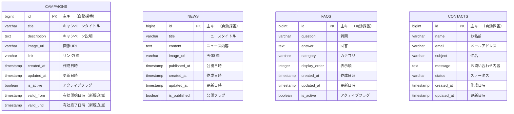

# データベース設計書 (ERD)

## 概要
ahamoダミーシステム コンテンツサービスのデータベース設計図

## エンティティ関係図

## テーブル詳細

### CAMPAIGNS テーブル
キャンペーン情報を管理するテーブル

| カラム名 | データ型 | NULL | デフォルト | 説明 |
|---------|---------|------|-----------|------|
| id | BIGINT | NOT NULL | AUTO_INCREMENT | 主キー |
| title | VARCHAR(255) | NOT NULL | - | キャンペーンタイトル |
| description | TEXT | NULL | - | キャンペーン説明 |
| image_url | VARCHAR(500) | NULL | - | 画像URL |
| link | VARCHAR(500) | NULL | - | リンクURL |
| created_at | TIMESTAMP | NOT NULL | CURRENT_TIMESTAMP | 作成日時 |
| updated_at | TIMESTAMP | NOT NULL | CURRENT_TIMESTAMP ON UPDATE | 更新日時 |
| is_active | BOOLEAN | NOT NULL | TRUE | アクティブフラグ |
| valid_from | TIMESTAMP | NULL | - | 有効開始日時（新規追加） |
| valid_until | TIMESTAMP | NULL | - | 有効終了日時（新規追加） |

**新機能追加内容:**
- `valid_from`: キャンペーンの有効開始日時を管理
- `valid_until`: キャンペーンの有効終了日時を管理
- これらのフィールドにより、時間ベースのキャンペーン有効性チェックが可能

### NEWS テーブル
ニュース情報を管理するテーブル

| カラム名 | データ型 | NULL | デフォルト | 説明 |
|---------|---------|------|-----------|------|
| id | BIGINT | NOT NULL | AUTO_INCREMENT | 主キー |
| title | VARCHAR(255) | NOT NULL | - | ニュースタイトル |
| content | TEXT | NOT NULL | - | ニュース内容 |
| image_url | VARCHAR(500) | NULL | - | 画像URL |
| published_at | TIMESTAMP | NULL | - | 公開日時 |
| created_at | TIMESTAMP | NOT NULL | CURRENT_TIMESTAMP | 作成日時 |
| updated_at | TIMESTAMP | NOT NULL | CURRENT_TIMESTAMP ON UPDATE | 更新日時 |
| is_published | BOOLEAN | NOT NULL | FALSE | 公開フラグ |

### FAQS テーブル
よくある質問を管理するテーブル

| カラム名 | データ型 | NULL | デフォルト | 説明 |
|---------|---------|------|-----------|------|
| id | BIGINT | NOT NULL | AUTO_INCREMENT | 主キー |
| question | VARCHAR(500) | NOT NULL | - | 質問 |
| answer | TEXT | NOT NULL | - | 回答 |
| category | VARCHAR(100) | NULL | - | カテゴリ |
| display_order | INTEGER | NOT NULL | 0 | 表示順 |
| created_at | TIMESTAMP | NOT NULL | CURRENT_TIMESTAMP | 作成日時 |
| updated_at | TIMESTAMP | NOT NULL | CURRENT_TIMESTAMP ON UPDATE | 更新日時 |
| is_active | BOOLEAN | NOT NULL | TRUE | アクティブフラグ |

### CONTACTS テーブル
お問い合わせ情報を管理するテーブル

| カラム名 | データ型 | NULL | デフォルト | 説明 |
|---------|---------|------|-----------|------|
| id | BIGINT | NOT NULL | AUTO_INCREMENT | 主キー |
| name | VARCHAR(100) | NOT NULL | - | お名前 |
| email | VARCHAR(255) | NOT NULL | - | メールアドレス |
| subject | VARCHAR(200) | NOT NULL | - | 件名 |
| message | TEXT | NOT NULL | - | お問い合わせ内容 |
| status | VARCHAR(50) | NOT NULL | 'PENDING' | ステータス |
| created_at | TIMESTAMP | NOT NULL | CURRENT_TIMESTAMP | 作成日時 |
| updated_at | TIMESTAMP | NOT NULL | CURRENT_TIMESTAMP ON UPDATE | 更新日時 |

## インデックス設計

### CAMPAIGNS テーブル
- PRIMARY KEY: `id`
- INDEX: `idx_campaigns_active` ON `is_active`
- INDEX: `idx_campaigns_valid_period` ON `valid_from, valid_until`
- INDEX: `idx_campaigns_created_at` ON `created_at`

### NEWS テーブル
- PRIMARY KEY: `id`
- INDEX: `idx_news_published` ON `is_published, published_at`
- INDEX: `idx_news_created_at` ON `created_at`

### FAQS テーブル
- PRIMARY KEY: `id`
- INDEX: `idx_faqs_active_order` ON `is_active, display_order`
- INDEX: `idx_faqs_category` ON `category`

### CONTACTS テーブル
- PRIMARY KEY: `id`
- INDEX: `idx_contacts_status` ON `status`
- INDEX: `idx_contacts_created_at` ON `created_at`
- INDEX: `idx_contacts_email` ON `email`

## データベース制約

### 外部キー制約
現在のシステムでは、各テーブルは独立しており、外部キー制約は設定されていません。

### チェック制約
- `CAMPAIGNS.is_active`: BOOLEAN値のみ許可
- `NEWS.is_published`: BOOLEAN値のみ許可
- `FAQS.is_active`: BOOLEAN値のみ許可
- `CONTACTS.status`: 'PENDING', 'IN_PROGRESS', 'RESOLVED', 'CLOSED'のみ許可

## パフォーマンス考慮事項

1. **ページネーション対応**: 全テーブルで`created_at`にインデックスを設定
2. **キャンペーン有効性チェック**: `valid_from`, `valid_until`の複合インデックスで高速検索
3. **アクティブレコード検索**: `is_active`フラグにインデックスを設定
4. **FAQ表示順**: `is_active`, `display_order`の複合インデックスで効率的なソート

## セキュリティ考慮事項

1. **個人情報保護**: CONTACTSテーブルの`email`は暗号化を検討
2. **データ保持期間**: 古いお問い合わせデータの定期削除ポリシー
3. **アクセス制御**: 管理者のみがCRUD操作可能な権限設計
