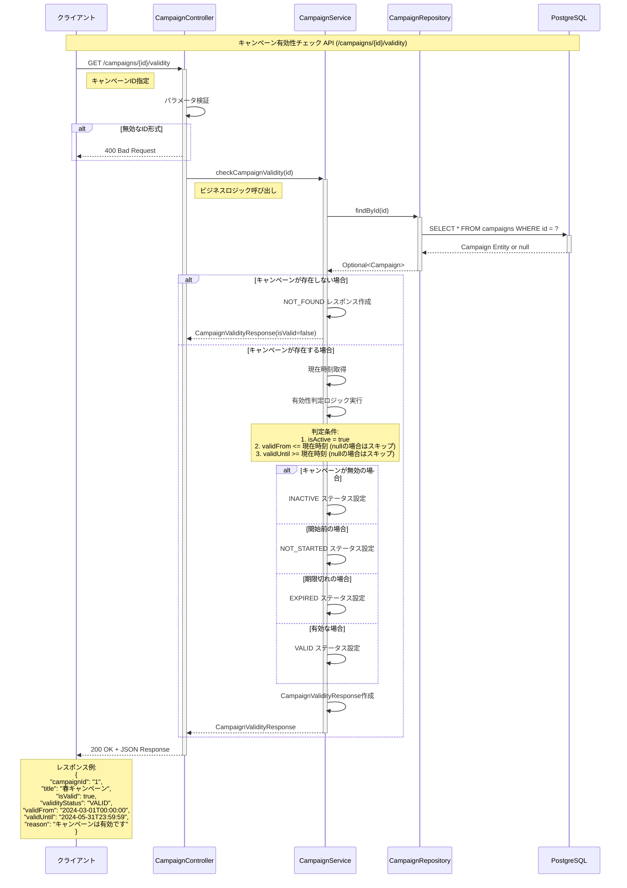
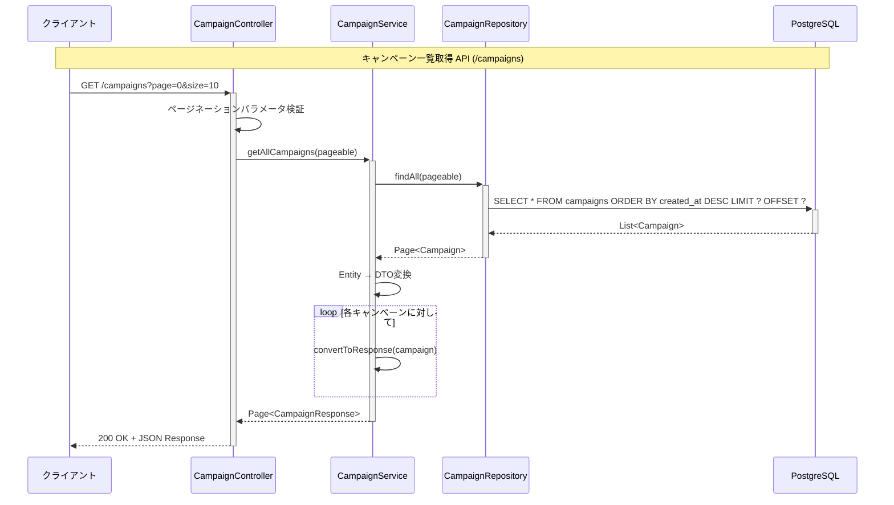
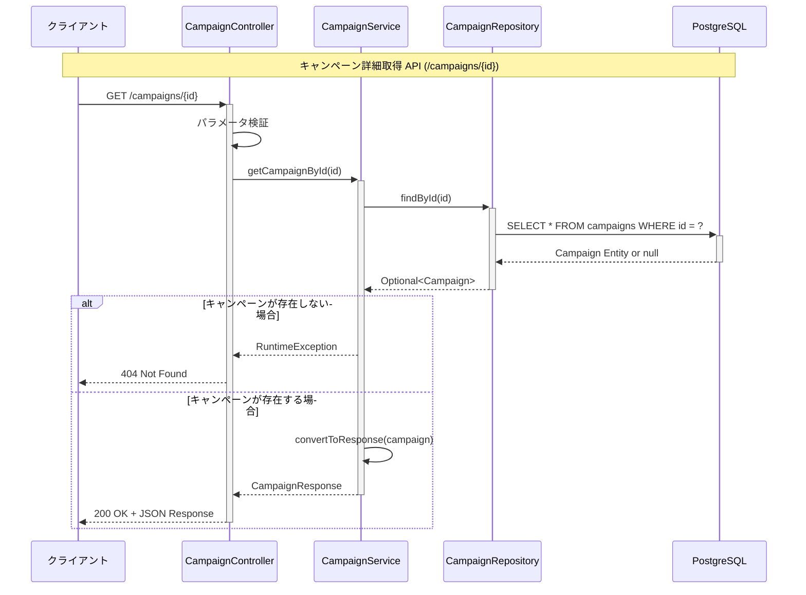
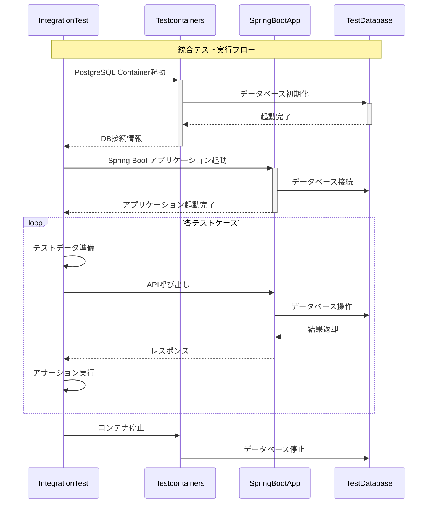

# シーケンス図

## 概要
ahamoダミーシステム コンテンツサービスのAPI呼び出しフローを示すシーケンス図

## キャンペーン有効性チェック API フロー



## キャンペーン一覧取得 API フロー



## キャンペーン詳細取得 API フロー



## エラーハンドリング フロー

```mermaid
sequenceDiagram
    participant Client as クライアント
    participant Controller as Controller
    participant ExceptionHandler as GlobalExceptionHandler
    participant Service as Service
    participant DB as Database

    Note over Client, DB: エラーハンドリングの共通フロー
    
    Client->>+Controller: API Request
    Controller->>+Service: Business Logic Call
    
    alt データベースエラー
        Service->>+DB: Database Query
        DB-->>-Service: SQLException
        Service-->>-Controller: DataAccessException
        Controller->>+ExceptionHandler: Exception Handling
        ExceptionHandler-->>-Controller: ErrorResponse
        Controller-->>Client: 500 Internal Server Error
    else バリデーションエラー
        Controller->>Controller: Parameter Validation
        Controller-->>Client: 400 Bad Request
    else リソースが見つからない
        Service-->>-Controller: EntityNotFoundException
        Controller->>+ExceptionHandler: Exception Handling
        ExceptionHandler-->>-Controller: ErrorResponse
        Controller-->>Client: 404 Not Found
    else 正常処理
        Service-->>-Controller: Success Response
        Controller-->>-Client: 200 OK
    end
```

## 統合テスト フロー



## パフォーマンス考慮事項

### データベースアクセス最適化
1. **インデックス活用**: `is_active`, `valid_from`, `valid_until`の複合インデックス
2. **ページネーション**: LIMIT/OFFSETによる効率的なデータ取得
3. **コネクションプール**: HikariCPによる接続管理

### キャッシュ戦略
1. **キャンペーン有効性**: 短時間キャッシュ（5分）で頻繁なDB問い合わせを削減
2. **一覧データ**: ページ単位でのキャッシュ実装
3. **CDN活用**: 画像URLの配信最適化

### 監視・ログ
1. **レスポンス時間**: 各APIエンドポイントの性能監視
2. **エラー率**: 4xx/5xxエラーの発生頻度追跡
3. **データベース負荷**: スロークエリの検出と最適化
